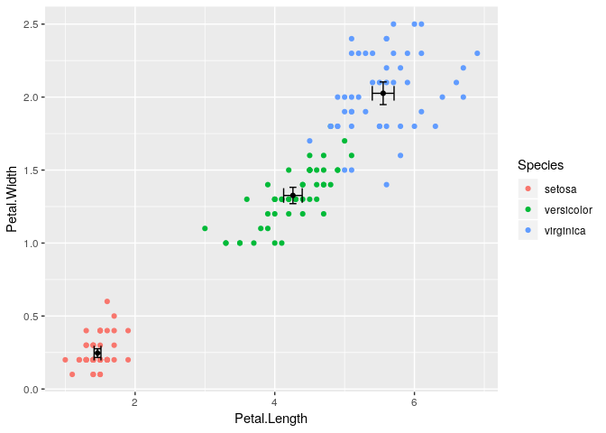

Using `ggerr`
=============

*Thomas Poulsen*, *2019-10-20*

The `ggerr` package makes it easier to add error-bars to pplots.

Adding errorbars of +/- one standard deviation in each group is done like this:

``` r
library(ggplot2)
library(ggerr)

ggplot(iris, aes(x = Petal.Length, y = Petal.Width, color = Species)) + geom_point() + stat_err() + stat_err(geom="point")
```


The second call to `stat_err()` with geom `"point"` is to add the point at the mean.

The `stat_err()` detaults to the geom `"errorbar"`, so the width of the whiskers are controlled through that:

``` r
ggplot(iris, aes(x = Petal.Length, y = Petal.Width, color = Species)) + geom_point() + stat_err(width=.1) + stat_err(geom="point")
```


Horizontal errorbars are obtained by the geom `"errorbarh"`. The `stat_err()` knows about standard deviation and standard error of the mean. They are selected by the `spread` parameter. It is possible to multiply the errorbars by a factor, using the `mult` parameter.

The grouping does not need to be coltrolled by the `color` aestetics, it can also be done through an explicit `group` aestetics.

As an example, we add vertical and horizontal errorbars of two times the standard error of the mean:

``` r
ggplot(iris, aes(x = Petal.Length, y = Petal.Width, group = Species)) + geom_point(aes(color=Species)) + stat_err(spread = "se", mult = 2, width=.1) + stat_err(geom="point") + stat_err(spread = "se", mult = 2, geom = "errorbarh", height = .1)
```



## Installation

Install the package using `devtools`:

``` r
devtools::install_github("tp2750/ggerr")
```
